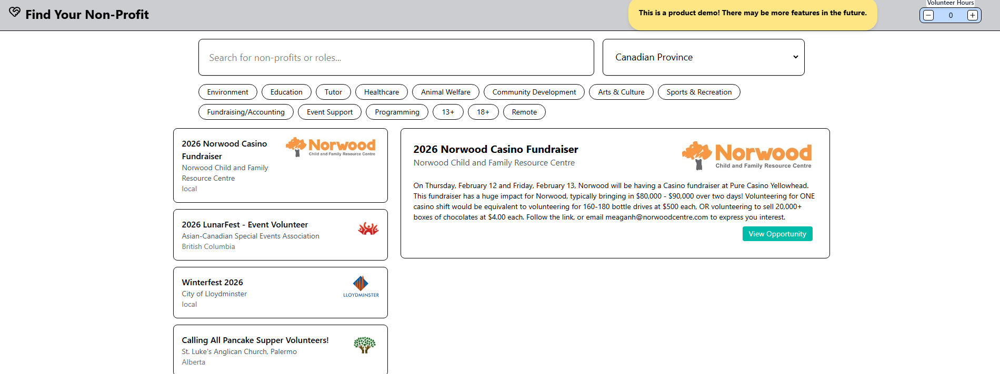

# Find-Your-Non-Profit (Volunteer Search Engine CA)

Find Canadian volunteer opportunities that fit your interests. Built for the Alameda Hackathon Jan 2026. The goal is to make it easier for students to find relevant volunteering opportunities across Canada. This project creates an abstraction layer using VolunteerConnector's listings. This results in a fast, search filterable experience using a modern React frontend and a .NET backend.

## Features

Search for volunteer opportunities with filters:

- Interests
- Region
- Age
- Remote availability
- Keyword search

Frontend UX:

- Simplistic design
- External links to official pages
- Responsive layout and loading/empty states

Performance focused backend:

- Parallel page fetching
- In-memory caching (3hr TTL)
- Interest inference from descriptions
- Age + Region suitability inference
- Duration estimation

## Tech Stack

**Frontend:**

- React + Typescript
- Vite
- TailwindCSS

**Backend:**

- .NET SDK v10.0
- ASP.NET Core via Swashbuckle
- SemaphoreSlim for concurrency control
- In-memory caching

**Data Source:**

- VolunteerConnector (Public API)

## How It Works

1. The backend preloads volunteer opportunities from VolunteerConnector across ~160 pages.
2. Results are cached in memory for 3 hours to reduce load and improve response time.
3. Opportunity descriptions are analyzed to infer:
   - Interests
   - Age suitability
   - Estimated duration
4. The frontend sends filter parameters to the backend search endpoint.
5. Filtered results are returned and displayed in a master–detail layout.



## Running Locally

```bash
dotnet run
```

Runs on:
A local host of your choice.

### Frontend

```bash
npm install
npm run dev
```

Runs on:
A local host of your choice.

---

## API Endpoint

```
GET /api/Volunteer/search
```

### Query Parameters

- `interests` – comma-separated list
- `region` – string
- `age` – string
- `isRemote` – boolean
- `q` – keyword search


---

## Why This Project

As a high school student, finding meaningful volunteer opportunities can be frustrating due to poor filtering and scattered listings. This project aims to:

- Reduce friction in discovering opportunities
- Highlight relevant matches
- Encourage student engagement in volunteering

## Acknowledgements

- VolunteerConnector for providing public volunteer data
- Hackathon organizers
- Open-source community
- Special thanks to Insomnia for API backend testing
